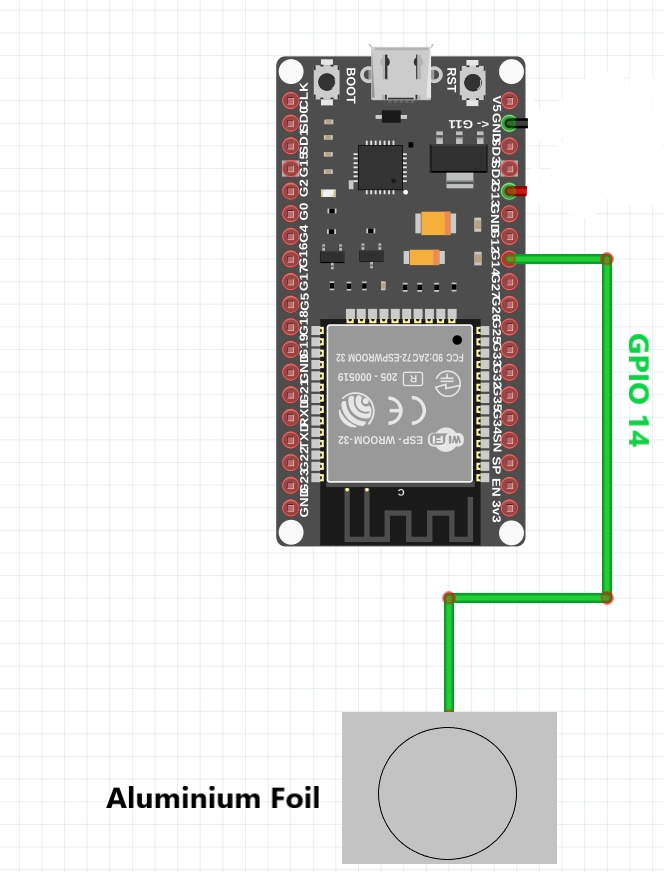
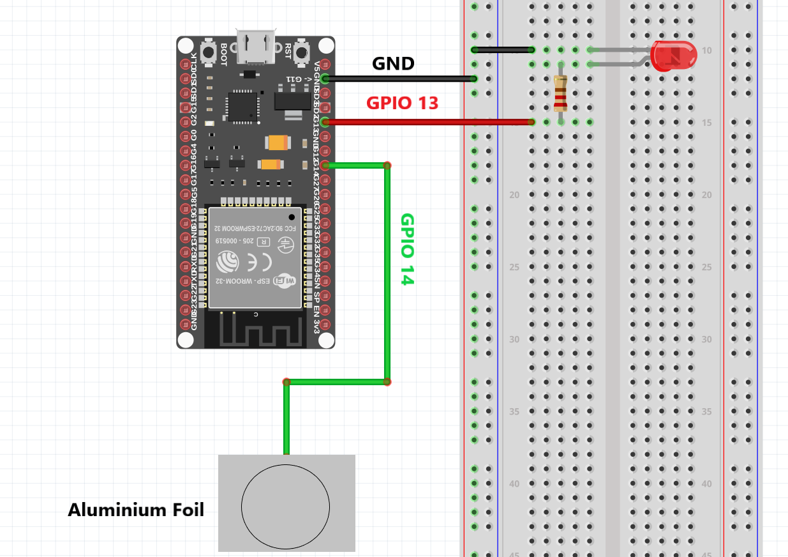

  <br><br>
# Capacitive-Touch-Switch-Using-ESP32
Here in this tutorial we are going to write a program to make a capacitive touch switch using ESP32 in Arduino IDE<br><br>
## Overview of ESP32

ESP32 is a series of low-cost, low-power system on a chip microcontrollers with integrated Wi-Fi and dual-mode Bluetooth. The ESP32 series employs a Tensilica Xtensa LX6 microprocessor in both dual-core and single-core variations and includes built-in antenna switches, RF balun, power amplifier, low-noise receive amplifier, filters, and power-management modules. ESP32 is created and developed by Espressif Systems, a Shanghai-based Chinese company, and is manufactured by TSMC using their 40 nm processor. It is a successor to the ESP8266 microcontroller<br><br>
  <br><br>
The ESP32 has 10 capacitive touch GPIOs. These GPIOs can sense variations in anything that holds an electrical charge, like the human skin. So they can detect variations induced when touching the GPIOs with a finger.  We are going to use this feature of ESP32 in our project<br>
We can use any of pin GPIO4 , GPIO2 , GPIO15 , GPIO12 , GPIO13 , GPIO14 , GPIO32 , GPIO33 as touch Sensor<br><br>
#  Sensor Reading
We need to find the sensor value, when ever user touches the aluminum foil that is connected to ESP32. For that we use `touchRead()` function, that accepts as argument, the GPIO you want to read.
## Schematic <br><br>
 <br><br>
* Connect the circuit as shown in the figure above 
* Connect the usb cable to ESP32 and connect to computer
* Launch Arduino IDE in computer
## Program <br><br>
``` cpp

void setup()
{
  Serial.begin(115200);
  delay(250); // give me time to bring up serial monitor
  Serial.println("ESP32 Touch Test");
}

void loop()
{
  Serial.println(touchRead(T6));  // get value using T6
  delay(250);
}
```
* Copy the program , paste it in Arduino IDE & save it
* Select the proper board and upload to it
* After Done Uploading , open Serial Monitor or press `Ctrl` + `Shift` + `M`
* Set baud rate to `115200`<br><br>
<br><br>
Sensor Value decreases when user touches the aluminum foil , Here i am going to take a threshold value of `45` in touch-switch program<br>
# Capacitive-Switch
Now we are going to make the capacitive switch using the help of `touchRead()` function
## Schematic<br><br>
 <br><br>
* Connect the circuit as shown in the figure above 
* Connect the usb cable to ESP32 and connect to computer
* Launch Arduino IDE in computer
## Program <br><br>
``` cpp
const unsigned long interval=200;  // const unsigned long interval is the used to give delay in program without interrupting the execution of program 
unsigned long previoustime=0; // we  used unsigned long data type to avoid occuring of error while working
int button=0;
void setup() {
  
 pinMode(13, OUTPUT); //Pin D13 in ESP32
 digitalWrite(13, LOW);
}

void loop() {
  unsigned long currenttime=millis(); // millis() : Returns the number of milliseconds passed since the Arduino board began running the current program
 
if (touchRead(T6) < 45 and button == 0){  // T6 is pin D14 on ESP32 it is capable to work as a touch sensor  
  if (currenttime - previoustime >= interval){
   digitalWrite(13, HIGH);
   button=1;
   previoustime=currenttime;
}
}
else if (touchRead(T6) <45 and button == 1) {
  if (currenttime - previoustime >= interval){
   digitalWrite(13, LOW);
   button=0;
   previoustime=currenttime;
}
}
}
```
* Copy the program , paste it in Arduino IDE & save it
* Select the proper board and upload to it
* Now, test your circuit
* Touch the aluminum foil and see the LED lighting turning on
* Again touch the aluminum foil and see the LED lighting turning off

