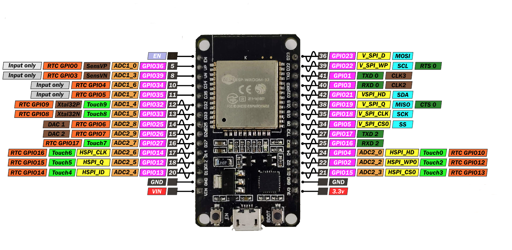

    
# Capacitive-Touch-Switch-Using-ESP32
Here in this tutorial we are going to write a program to make a capacitive touch switch using ESP32 in Arduino IDE  
## Overview of ESP32

ESP32 is a series of low-cost, low-power system on a chip microcontrollers with integrated Wi-Fi and dual-mode Bluetooth. The ESP32 series employs a Tensilica Xtensa LX6 microprocessor in both dual-core and single-core variations and includes built-in antenna switches, RF balun, power amplifier, low-noise receive amplifier, filters, and power-management modules. ESP32 is created and developed by Espressif Systems, a Shanghai-based Chinese company, and is manufactured by TSMC using their 40 nm process. It is a successor to the ESP8266 microcontroller  
    
The ESP32 has 10 capacitive touch GPIOs. These GPIOs can sense variations in anything that holds an electrical charge, like the human skin. So they can detect variations induced when touching the GPIOs with a finger. 
 We are going to use this feature of ESP32 in our project , we can use any of pin GPIO4,GPIO2,GPIO15,GPIO12,GPIO13,GPIO14,GPIO32,GPIO33 as touch Sensor
